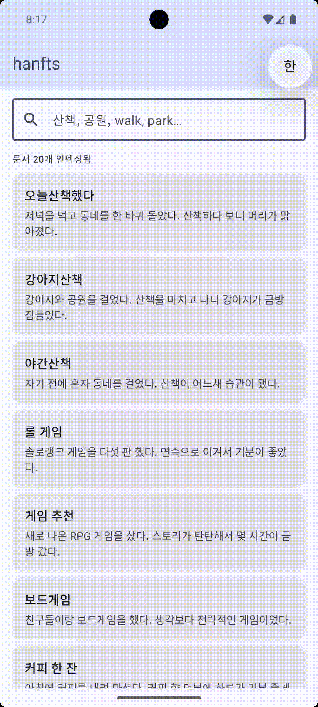

<div align="center">

# hanfts

**Android용 네이티브 전문 검색 — 한국어 & 영어, 의존성 없음, 순수 인메모리.**

[](https://opensource.org/licenses/Apache-2.0)
[](https://search.maven.org/artifact/io.github.m1n9yu23/hanfts)
[](https://android-arsenal.com/api?level=21)
[](https://kotlinlang.org)
[](https://isocpp.org)
[](https://github.com/M1n9yu23/hanfts/actions/workflows/android.yml)

**[English](README.md)**



</div>

## 개요

hanfts는 한국어와 영어를 모두 지원하는 Android 전문 검색 라이브러리입니다. C++17로 구현된 바이그램 토크나이저를 사용하여 한국어 부분 검색을 지원합니다.

## 배경

Room 기본 설정에서 `"산책"`을 검색하면 `"오늘산책했다"`가 포함된 문서는 찾을 수 없습니다.

<div align="center">
  
  
  
</div>

hanfts는 별도 설정 없이 바로 동작하는 대안으로, 한국어 텍스트를 유니코드 코드포인트 단위로 겹치는 바이그램으로 분리하여 형태소 분석기 없이도 부분 검색과 프리픽스 검색이 동작합니다.

## 기능

- **한국어 바이그램 토크나이징** — 유니코드 코드포인트 단위 2-gram 중첩 분리; 형태소 분석기 불필요
- **영어 단어 토크나이징** — 대소문자 무관, 공백 기준 토큰 분리
- **혼합 언어 지원** — 동일 문서 내 한국어와 영어를 각각 처리
- **프리픽스 검색** — `"산"` 입력 시 `"산책"`, `"산보"` 등 실시간 매칭
- **TF-IDF 랭킹** — 관련도 점수 산출; 제목은 본문 대비 3배 가중치
- **스레드 안전** — `std::shared_mutex`를 통한 동시 읽기; 쓰기는 독점 잠금
- **순수 인메모리** — 파일 I/O 없음, Android `Context` 불필요, 권한 불필요
- **네이티브 의존성 없음** — 순수 C++17 STL만 사용
- **명시적 해제** — `close()` 또는 `use { }`를 통한 네이티브 메모리 결정적 해제

## 설치

hanfts는 Maven Central에서 제공됩니다. 별도의 저장소 설정은 필요 없습니다.

```kotlin
dependencies {
    implementation("io.github.m1n9yu23:hanfts:<version>")
}
```

> `<version>`을 [최신 릴리스](https://github.com/M1n9yu23/hanfts/releases)로 교체하세요.

## 빠른 시작

### 생성 및 해제

```kotlin
val engine = SearchEngine()

engine.close()

SearchEngine().use { engine ->
    // ...
}
```

### 색인 구성

```kotlin
engine.rebuildIndex(
    listOf(
        Document(id = 1L, title = "오늘의 산책", body = "날씨가 맑아서 공원을 걸었다."),
        Document(id = 2L, title = "Morning Walk", body = "The park was quiet and peaceful."),
    )
)

engine.indexDocument(id = 3L, title = "제목", body = "본문 내용")
engine.indexDocument(Document(id = 4L, title = "Title", body = "Body text"))
```

### 검색

```kotlin
val results = engine.search("산책")
// → [SearchResult(id=1, score=1.82f)]

val results = engine.search("산책", limit = 5)
```

### 수정 및 삭제

```kotlin
engine.indexDocument(id = 1L, title = "수정된 제목", body = "수정된 본문")

engine.removeDocument(id = 1L)

engine.clear()
```

### ViewModel 사용 예시

엔진은 어떤 아키텍처에도 통합할 수 있습니다. 아래는 `ViewModel`을 사용하는 예시입니다.

```kotlin
class SearchViewModel : ViewModel() {

    private val engine = SearchEngine()

    init {
        viewModelScope.launch(Dispatchers.Default) {
            engine.rebuildIndex(/* 문서 목록 */)
        }
    }

    fun search(query: String): List<SearchResult> =
        engine.search(query)

    override fun onCleared() {
        super.onCleared()
        engine.close()
    }
}
```

## API 레퍼런스

### `SearchEngine`

팩토리 함수로 인스턴스를 얻습니다:

```kotlin
val engine = SearchEngine()
```

| 메서드 / 프로퍼티 | 설명 |
|---|---|
| `documentCount: Int` | 현재 색인에 있는 문서 수. |
| `indexDocument(id, title, body)` | 문서를 추가하거나 교체합니다. `id`가 이미 있으면 교체. |
| `indexDocument(document: Document)` | `Document`를 받는 편의 오버로드. |
| `removeDocument(id: Long)` | ID로 문서를 제거합니다. 없으면 무시. |
| `clear()` | 색인의 모든 문서를 제거합니다. |
| `search(query, limit = 20)` | TF-IDF 점수 내림차순으로 결과를 반환합니다. 빈 쿼리는 빈 리스트 반환. |
| `rebuildIndex(documents: List<Document>)` | 전체 색인을 원자적으로 초기화하고 재구성합니다. |
| `close()` | 네이티브 메모리를 해제합니다. 닫힌 후에는 엔진을 사용하지 마세요. |

> **스레딩:** 모든 변경 연산(`indexDocument`, `removeDocument`, `rebuildIndex`, `clear`)은 내부 잠금을 획득하며 블로킹입니다. `Dispatchers.Default`에서 실행하세요. 동시 `search()` 호출은 항상 안전합니다.

### `Document`

```kotlin
data class Document(
    val id: Long,
    val title: String,
    val body: String,
)
```

### `SearchResult`

```kotlin
data class SearchResult(
    val id: Long,
    val score: Float,
)
```

## 동작 원리

### 토크나이저

| 입력 | 언어 | 토큰 |
|---|---|---|
| `"오늘산책"` | 한국어 | `["오늘", "늘산", "산책", "오늘산책"]` |
| `"오늘산책했다"` | 한국어 (5자 이상) | `["오늘", "늘산", "산책", "책했", "했다"]` |
| `"Good morning"` | 영어 | `["good", "morning"]` |
| `"meeting 미팅"` | 혼합 | `["meeting", "미팅"]` |

한국어 텍스트는 유니코드 코드포인트 단위로 겹치는 바이그램으로 분리됩니다. **4코드포인트 이하** 단어는 정확한 매칭 재현율 향상을 위해 전체 단어도 토큰으로 추가로 발행합니다.

지원하는 한국어 유니코드 범위:

```
U+AC00–U+D7A3  한글 음절 (가–힣)
U+1100–U+11FF  한글 자모
U+3130–U+318F  한글 호환 자모
U+A960–U+A97F  한글 자모 확장-A
U+D7B0–U+D7FF  한글 자모 확장-B
```

### 점수 계산

```
TF    = 문서 내 용어 빈도 / 문서의 총 가중 용어 수
IDF   = log((N + 1) / (df + 1)) + 1    (스무딩 — 항상 ≥ 1)
Score = TF × IDF
```

`N` = 전체 문서 수, `df` = 해당 용어를 포함하는 문서 수.  
제목 토큰은 본문 토큰 대비 **3배** 가중치를 가집니다.

### 프리픽스 검색

`std::map::lower_bound(token)`으로 첫 번째 일치 용어를 찾고, 쿼리 토큰으로 시작하는 동안 이터레이터를 전진합니다. 단일 문자 쿼리의 과도한 팽창을 방지하기 위해 **토큰당 최대 64개 일치 용어**로 제한합니다.

### 아키텍처

```
SearchEngine            ← Kotlin 공개 인터페이스 (팩토리: SearchEngine())
    │
    │  JNI — libhanfts.so
    ▼
NativeSearchEngine      ← internal Kotlin 클래스, AtomicLong 핸들
    │
    ▼
fts::SearchEngine       ← C++ API + std::shared_mutex 동시성
    ├── fts::InvertedIndex  — TF-IDF 포스팅 리스트, std::map을 통한 프리픽스 스캔
    └── fts::Tokenizer      — UTF-8 → 코드포인트 → 바이그램 / 단어
```

`NativeSearchEngine`은 `internal`입니다 — 사용자는 `SearchEngine` 인터페이스만 사용합니다. C++ 객체는 `AtomicLong`을 통한 불투명 `jlong` 핸들로 관리되며, `close()`는 동시 시나리오에서 이중 해제를 방지하기 위해 `getAndSet(0)`을 사용합니다.

## 참고사항

- **색인은 인메모리 전용입니다.** 색인은 디스크에 저장되지 않습니다. 앱 시작 시마다 `rebuildIndex()`를 호출하세요. 일반적으로 ViewModel의 `init` 블록에서 `Dispatchers.Default`로 실행합니다.
- **`close()`를 반드시 호출하세요.** 엔진은 네이티브 메모리를 보유합니다. ViewModel의 `onCleared`에 생명주기를 연결하거나 `use { }` 블록을 사용하여 반드시 해제하세요.
- **바이그램 토크나이징에는 트레이드오프가 있습니다.** 한 글자 쿼리는 많은 수의 문서와 매칭될 수 있습니다. 프리픽스 스캔은 토큰당 최대 64개로 제한되어 결과를 관리 가능한 수준으로 유지합니다.
- **변경 연산은 블로킹입니다.** `rebuildIndex`, `indexDocument`, `removeDocument`, `clear`는 독점 쓰기 잠금을 획득합니다. 메인 스레드에서 호출하지 마세요.
- **`search()`는 동시 호출이 안전합니다.** 여러 스레드가 추가 동기화 없이 동시에 검색할 수 있습니다.

## 성능

[Microbenchmark](https://developer.android.com/topic/performance/benchmarking/microbenchmark-overview) 라이브러리를 사용하여 **Android 16 에뮬레이터**(Pixel 6a AVD, 4코어 CPU, 2GHz)에서 측정한 결과입니다. 실제 기기 결과와 다를 수 있습니다.

| 동작 | 중앙값(Median) |
|---|---|
| `search("morning")` — 영어, 문서 10k개 | **673 µs** |
| `search("산책")` — 한국어, 문서 10k개 | **594 µs** |
| `rebuildIndex(1k 문서)` | **6.95 ms** |
| `rebuildIndex(10k 문서)` | **83 ms** |

> 10,000개 문서 색인에서 한국어·영어 모두 서브 밀리초의 검색 지연을 달성합니다.

## 요구사항

- Android **minSdk 21** (Android 5.0 Lollipop)
- NDK **r25+**
- CMake **3.22.1+**
- C++17

ABI 대상: `arm64-v8a`, `armeabi-v7a`, `x86_64`

## 참고 자료

- **[Introduction to Information Retrieval](https://nlp.stanford.edu/IR-book/)** — 역색인(Inverted Index) 자료구조, TF-IDF 스코어링, 스무딩 IDF 변형(`log((N+1)/(df+1)) + 1`)의 이론적 기반.
- **[RFC 3629 — UTF-8, a transformation format of ISO 10646](https://www.rfc-editor.org/rfc/rfc3629)** — 수동 UTF-8 디코더(1~4바이트 시퀀스) 구현의 참조 명세.
- **[Unicode Standard — Hangul Blocks](https://www.unicode.org/charts/)** — 한글 유니코드 블록 범위 정의 (음절 U+AC00–U+D7A3, 자모, 호환 자모, 확장 블록).
- **[Android NDK — JNI Tips](https://developer.android.com/training/articles/perf-jni)** — 포인터-핸들 패턴, `DeleteLocalRef` 관리, `JNI_ABORT` 플래그 등 JNI 구현 관용구.
- **[cppreference — std::shared_mutex](https://en.cppreference.com/w/cpp/thread/shared_mutex)** — Readers-Writer Lock 구현 (C++17).

## 기여

모든 기여를 환영합니다 — 버그 수정, 성능 개선, 새로운 언어 지원, 문서화.

자세한 내용은 [CONTRIBUTING.md](CONTRIBUTING.md)를 참고하세요.

## 라이선스

```
Copyright 2026 Gyugle

Licensed under the Apache License, Version 2.0 (the "License");
you may not use this file except in compliance with the License.
You may obtain a copy of the License at

    http://www.apache.org/licenses/LICENSE-2.0

Unless required by applicable law or agreed to in writing, software
distributed under the License is distributed on an "AS IS" BASIS,
WITHOUT WARRANTIES OR CONDITIONS OF ANY KIND, either express or implied.
See the License for the specific language governing permissions and
limitations under the License.
```
